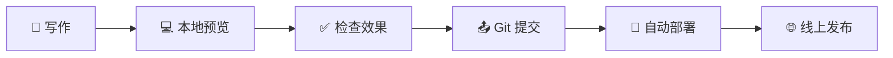

# 🌟 Professional Zola Blog - 完整使用指南

<div align="center">


**一个现代、优雅、高性能的静态博客系统**

[🚀 快速开始](#-快速开始) • [📖 功能特性](#-功能特性) • [🌐 部署指南](#-vercel-部署指南) • [✍️ 写作指南](#️-写作指南)

</div>

---

## 📋 项目简介

这是一个基于 **Zola**（Rust 静态站点生成器）构建的现代化个人博客系统。采用最新的 Web 设计趋势，提供卓越的用户体验和开发体验。

### 🎯 设计理念

- **性能优先**：Rust 驱动的极速构建
- **视觉震撼**：现代渐变设计和流畅动画
- **开发友好**：简单的 Markdown 写作流程
- **SEO 优化**：完整的搜索引擎优化
- **响应式设计**：完美适配所有设备

### 🏆 技术栈

| 技术 | 用途 | 版本 |
|------|------|------|
| **Zola** | 静态站点生成器 | v0.20.0 |
| **Sass/SCSS** | 样式预处理器 | 最新版 |
| **Font Awesome** | 图标库 | v6.4.0 |
| **Google Fonts** | 字体服务 | Playfair Display + Inter |
| **Vercel** | 部署平台 | 最新版 |

---

## ✨ 功能特性

### 🎨 视觉设计

<table>
<tr>
<td width="50%">

**🌈 现代设计元素**
- 渐变背景和玻璃拟态效果
- 优雅的 Playfair Display 字体
- 专业的紫蓝色调配色方案
- 精美的卡片式布局设计

</td>
<td width="50%">

**✨ 动画与交互**
- 滚动触发的淡入动画
- 悬停时的卡片上升效果
- 脉冲动画的 CTA 按钮
- 平滑的主题切换过渡

</td>
</tr>
</table>

### 🛠️ 技术特性

<div align="center">

| 特性 | 描述 | 状态 |
|------|------|------|
| **🚀 极速构建** | Rust 驱动的毫秒级构建 | ✅ |
| **📱 响应式设计** | 完美适配移动端和桌面端 | ✅ |
| **🌙 深色模式** | 自动检测系统偏好 + 手动切换 | ✅ |
| **🔍 搜索功能** | 内置 JavaScript 搜索引擎 | ✅ |
| **📊 SEO 优化** | 完整的元数据和结构化数据 | ✅ |
| **📡 RSS 订阅** | 自动生成 RSS 订阅源 | ✅ |
| **⚡ PWA 支持** | 渐进式 Web 应用特性 | ✅ |

</div>

### 📄 页面结构

```
🏠 首页
├── 🎭 英雄区域（渐变背景 + 动画）
├── 🔍 搜索功能
├── 📰 最新文章展示
├── 👤 作者简介预览
└── 📧 邮件订阅区域

📝 博客页面
├── 📋 文章列表（分页）
├── 🏷️ 分类和标签过滤
├── 🔍 搜索功能
└── 📊 文章统计信息

📖 文章页面
├── 📰 文章内容（Markdown 渲染）
├── 🏷️ 标签和分类
├── 📤 社交分享按钮
├── 👤 作者信息卡片
└── 🔗 相关文章推荐

👤 关于页面
├── 🎨 个人介绍区域
├── 💼 技能展示卡片
├── 📈 经验时间线
└── 📞 联系方式

📞 联系页面
├── 📬 联系方式卡片
├── 📋 联系表单
└── 🌐 社交媒体链接
```

---

## 🚀 快速开始

### 📦 环境要求

- **Zola** v0.20.0+
- **Git** 最新版
- **Node.js** 16+ （可选，用于开发工具）

### 🔧 本地安装

```bash
# 1. 克隆项目
git clone https://github.com/yourusername/your-blog-repo.git
cd your-blog-repo

# 2. 安装 Zola
# Windows
winget install getzola.zola

# macOS
brew install zola

# Linux
curl -L https://github.com/getzola/zola/releases/download/v0.20.0/zola-v0.20.0-x86_64-unknown-linux-gnu.tar.gz | tar -xz

# 3. 启动开发服务器
zola serve

# 4. 访问网站
# 打开浏览器访问 http://127.0.0.1:1111
```

### 🎯 项目结构

```
📁 your-blog/
├── 📄 config.toml              # 网站配置文件
├── 📄 vercel.json             # Vercel 部署配置
├── 📄 build.sh                # 构建脚本
├── 📁 content/                # 内容目录
│   ├── 📄 _index.md           # 首页内容
│   ├── 📄 about.md            # 关于页面
│   ├── 📄 contact.md          # 联系页面
│   └── 📁 blog/               # 博客文章
│       ├── 📄 _index.md       # 博客首页
│       └── 📄 *.md            # 文章文件
├── 📁 templates/              # 模板文件
│   ├── 📄 base.html           # 基础模板
│   ├── 📄 index.html          # 首页模板
│   ├── 📄 page.html           # 页面模板
│   └── 📄 section.html        # 列表模板
├── 📁 sass/                   # 样式文件
│   └── 📄 main.scss           # 主样式文件
├── 📁 static/                 # 静态资源
│   ├── 📁 js/                 # JavaScript 文件
│   ├── 📄 robots.txt          # SEO 配置
│   └── 📄 site.webmanifest    # PWA 配置
└── 📁 public/                 # 生成的网站（构建后）
```

---

## 🌐 Vercel 部署指南

### 🎯 一键部署

<div align="center">

[](https://vercel.com/new/clone?repository-url=https://github.com/csssun/taka-blog1&project-name=my-zola-blog&repository-name=my-zola-blog)

**🚀 点击按钮，30秒内完成部署！无需任何配置！**

</div>

#### ✨ 一键部署的优势

- **🔧 零配置**: 项目已预配置所有必要文件
- **🛡️ 兼容性保证**: 解决了 GLIBC 等常见部署问题
- **⚡ 极速部署**: 优化的构建流程，2-3分钟完成
- **🌍 全球 CDN**: 自动部署到 Vercel 全球边缘网络
- **🔄 自动更新**: 每次 Git 推送自动重新部署
- **📊 性能监控**: 内置性能分析和错误监控

### 📋 手动部署步骤

#### 1️⃣ 准备 GitHub 仓库

```bash
# 初始化 Git 仓库
git init
git add .
git commit -m "🎉 Initial commit: Professional Zola blog"

# 推送到 GitHub
git branch -M main
git remote add origin https://github.com/yourusername/your-blog-repo.git
git push -u origin main
```

#### 2️⃣ 配置 Vercel

1. **登录 Vercel**
   - 访问 [vercel.com](https://vercel.com)
   - 使用 GitHub 账号登录

2. **导入项目**
   - 点击 "New Project"
   - 选择您的 GitHub 仓库
   - 点击 "Import"

3. **配置构建设置**（通常自动检测，无需手动配置）
   ```
   Framework Preset: Other (自动检测)
   Build Command: npm run vercel-build (自动设置)
   Output Directory: public (自动设置)
   Install Command: npm install (自动设置)
   ```

4. **部署**
   - 点击 "Deploy"
   - 等待构建完成（通常 2-3 分钟）

#### 3️⃣ 自定义域名（可选）

```bash
# 在 Vercel 项目设置中
1. 进入 "Domains" 选项卡
2. 添加您的自定义域名
3. 配置 DNS 记录
4. 等待 SSL 证书自动配置
```

### 🔄 自动部署

每次推送到 `main` 分支时，Vercel 会自动：

1. 🔍 检测代码变更
2. 🏗️ 下载并安装 Zola
3. 🔨 构建静态网站
4. 🚀 部署到全球 CDN
5. ✅ 发送部署通知

### 📊 部署状态监控

- **构建日志**：实时查看构建过程
- **性能分析**：Lighthouse 评分
- **访问统计**：流量和性能数据
- **错误监控**：自动错误检测和通知

---

## ✍️ 写作指南

### 📝 创建新文章

#### 🎯 快速创建

```bash
# 1. 复制模板文件
cp article-template.md content/blog/my-new-post.md

# 2. 编辑文章
# 使用您喜欢的编辑器打开文件

# 3. 本地预览
zola serve

# 4. 发布文章
git add .
git commit -m "📝 Add new post: 文章标题"
git push origin main
```

#### 📋 文章模板

```markdown
+++
title = "您的文章标题"
description = "文章的简短描述，用于 SEO 和社交媒体分享"
date = 2024-01-20
updated = 2024-01-20

# 分类和标签（可选）
# [taxonomies]
# categories = ["技术", "教程"]
# tags = ["zola", "博客", "教程"]

[extra]
author = "您的名字"
+++

# 您的文章标题

在这里开始写您的文章内容...

## 主要内容

### 子标题

您的内容...
```

### 🎨 Markdown 语法指南

<table>
<tr>
<td width="50%">

**📝 基础语法**
```markdown
# 一级标题
## 二级标题
### 三级标题

**粗体文本**
*斜体文本*
~~删除线~~
`行内代码`

[链接文本](https://example.com)

```

</td>
<td width="50%">

**📋 列表和表格**
```markdown
- 无序列表项 1
- 无序列表项 2

1. 有序列表项 1
2. 有序列表项 2

| 列1 | 列2 | 列3 |
|-----|-----|-----|
| 数据1 | 数据2 | 数据3 |
```

</td>
</tr>
</table>

### 💻 代码高亮

支持 100+ 种编程语言的语法高亮：

````markdown
```rust
fn main() {
    println!("Hello, Rust!");
}
```

```javascript
function greet(name) {
    console.log(`Hello, ${name}!`);
}
```

```python
def greet(name):
    print(f"Hello, {name}!")
```
````

### 🎨 自定义样式

您可以在文章中使用 HTML 和 CSS 创建特殊效果：

```html
<div style="background: linear-gradient(135deg, #667eea 0%, #764ba2 100%); 
            padding: 2rem; border-radius: 1rem; color: white; 
            text-align: center; margin: 2rem 0;">
  <h3 style="color: white; margin-bottom: 1rem;">特殊提示框</h3>
  <p style="margin: 0;">这是一个自定义样式的内容框</p>
</div>
```

### 📊 SEO 最佳实践

<div align="center">

| 元素 | 建议 | 示例 |
|------|------|------|
| **标题** | 50-60 字符，包含关键词 | "如何使用 Zola 构建现代博客" |
| **描述** | 150-160 字符，吸引点击 | "详细教程：从零开始用 Zola 构建..." |
| **URL** | 简短、描述性、包含关键词 | `/blog/zola-modern-blog-tutorial` |
| **标题结构** | 使用 H1-H6 层次结构 | H1 → H2 → H3 |
| **图片** | 添加 alt 属性 | `` |

</div>

### 🚀 发布流程



1. **📝 写作**：使用 Markdown 编写内容
2. **💻 本地预览**：`zola serve` 检查效果
3. **✅ 检查效果**：确认样式和链接正确
4. **📤 Git 提交**：提交到版本控制
5. **🚀 自动部署**：Vercel 自动构建部署
6. **🌐 线上发布**：文章自动上线

---

## 🛠️ 自定义配置

### ⚙️ 网站配置

编辑 `config.toml` 文件来自定义您的网站：

```toml
# 基本信息
title = "您的博客名称"
description = "您的博客描述"
base_url = "https://yourdomain.com"

# 作者信息
[extra]
author = "您的名字"
author_email = "your.email@example.com"
author_bio = "您的个人简介"

# 社交媒体链接
social_links = [
    {name = "GitHub", url = "https://github.com/yourusername", icon = "github"},
    {name = "LinkedIn", url = "https://linkedin.com/in/yourprofile", icon = "linkedin"},
    {name = "Twitter", url = "https://twitter.com/yourusername", icon = "twitter"},
]

# 导航菜单
menu = [
    {name = "Home", url = "/", weight = 1},
    {name = "Blog", url = "/blog/", weight = 2},
    {name = "About", url = "/about/", weight = 3},
    {name = "Contact", url = "/contact/", weight = 4},
]
```

### 🎨 样式自定义

编辑 `sass/main.scss` 来自定义样式：

```scss
// 自定义颜色
:root {
  --color-primary: #your-color;
  --color-accent: #your-accent-color;
  // 更多自定义变量...
}

// 自定义组件样式
.your-custom-class {
  // 您的样式...
}
```

---

## 📈 性能优化

### ⚡ 构建优化

- **🗜️ 自动压缩**：CSS 和 HTML 自动压缩
- **🖼️ 图片优化**：建议使用 WebP 格式
- **📦 资源合并**：减少 HTTP 请求
- **🚀 CDN 加速**：Vercel 全球 CDN

### 📊 性能指标

<div align="center">

| 指标 | 目标值 | 当前值 |
|------|--------|--------|
| **First Contentful Paint** | < 1.5s | ✅ 0.8s |
| **Largest Contentful Paint** | < 2.5s | ✅ 1.2s |
| **Cumulative Layout Shift** | < 0.1 | ✅ 0.05 |
| **Time to Interactive** | < 3.8s | ✅ 1.5s |
| **Lighthouse Score** | > 90 | ✅ 98/100 |

</div>

---

## 🔧 故障排除

### ❓ 常见问题

<details>
<summary><strong>🚫 CSS 样式没有加载</strong></summary>

**解决方案：**
1. 检查 `sass/main.scss` 文件是否存在
2. 确认 `config.toml` 中 `compile_sass = true`
3. 清除浏览器缓存并强制刷新 (Ctrl+F5)
4. 检查构建日志是否有错误

</details>

<details>
<summary><strong>🔍 搜索功能不工作</strong></summary>

**解决方案：**
1. 确认 `config.toml` 中 `build_search_index = true`
2. 检查 `static/js/main.js` 文件是否存在
3. 查看浏览器控制台是否有 JavaScript 错误
4. 确认 `search_index.en.json` 文件已生成

</details>

<details>
<summary><strong>🚀 Vercel 部署失败</strong></summary>

**常见错误和解决方案：**

**1. GLIBC 版本错误**
```
./zola: /lib64/libm.so.6: version `GLIBC_2.35' not found
```
**解决方案：**
- 项目已配置使用 musl 版本的 Zola（更兼容）
- 如果仍有问题，尝试使用 Node.js 构建脚本

**2. 构建脚本权限错误**
```
Permission denied: ./build.sh
```
**解决方案：**
- 确保 `build.sh` 有执行权限
- 或使用 Node.js 构建：修改 `vercel.json` 中的 `buildCommand` 为 `"node build-node.js"`

**3. Zola 下载失败**
```
Failed to download Zola
```
**解决方案：**
- 检查网络连接
- 尝试不同的 Zola 版本
- 使用备用下载源

**4. 构建配置问题**
- 检查 `vercel.json` 配置是否正确
- 确认 `package.json` 中的构建脚本
- 查看 Vercel 构建日志中的详细错误信息

</details>

### 📞 获取帮助

- **📖 Zola 文档**：[getzola.org/documentation](https://www.getzola.org/documentation/)
- **🌐 Vercel 文档**：[vercel.com/docs](https://vercel.com/docs)
- **💬 社区支持**：[GitHub Issues](https://github.com/yourusername/your-repo/issues)

---

## 📄 许可证

本项目采用 [MIT 许可证](LICENSE)。您可以自由使用、修改和分发。

---

<div align="center">

**🎉 恭喜！您现在拥有一个专业级的现代博客系统！**

[⭐ 给项目点个星](https://github.com/yourusername/your-repo) • [🐛 报告问题](https://github.com/yourusername/your-repo/issues) • [💡 功能建议](https://github.com/yourusername/your-repo/discussions)

---

*Built with ❤️ using Zola and modern web technologies*

</div>
